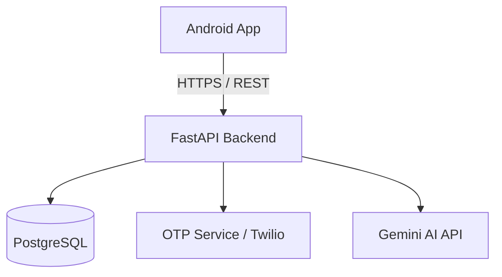

# HearU

HearU is a secure, anonymous peer-to-peer emotional support platform designed to connect individuals seeking a safe space to share their feelings and receive support.


## Features
- **Anonymous Connection:** Users remain anonymous until a friend request is sent and accepted.
- **Dual Verification:** Secure authentication via Mobile OTP and Email OTP.
- **AI Support Integration:** Conversational support powered by Gemini AI.
- **Crisis Detection:** Proactive detection of critical mental health distress signals.
- **Friend Requests:** Opt-in system for transitioning from anonymous peer to connected friend.

## Tech Stack
- **Frontend:** Android / Kotlin
- **Backend:** FastAPI (Python)
- **AI Integration:** Google Gemini AI

## Architecture



## Setup Instructions

### Backend (FastAPI)
1. Navigate to the `backend` directory.
2. Install dependencies:
   ```bash
   pip install -r requirements.txt
   ```
3. Run the server:
   ```bash
   uvicorn app.main:app --reload
   ```
   *Alternatively, use Docker:*
   ```bash
   docker build -t hearu-backend .
   docker run -p 8000:8000 hearu-backend
   ```

### Android
1. Open the `android` folder in Android Studio.
2. Sync Gradle files.
3. Build and run the app on an emulator or physical device.

## Contributing
We welcome contributions! Please review the open issues and submit pull requests. Ensure your code follows our style guidelines and passes all CI checks.

## License
This project is licensed under the MIT License - see the LICENSE file for details.
